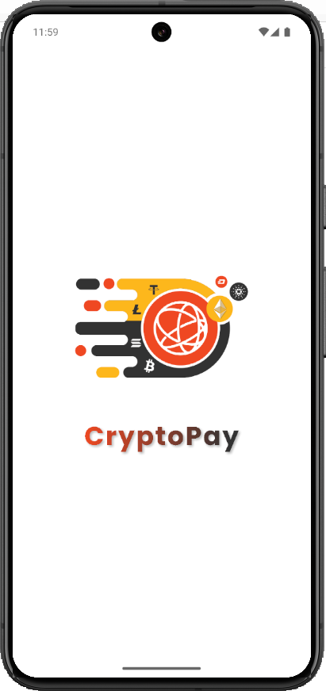
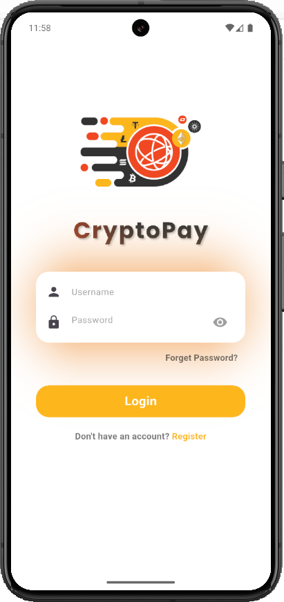
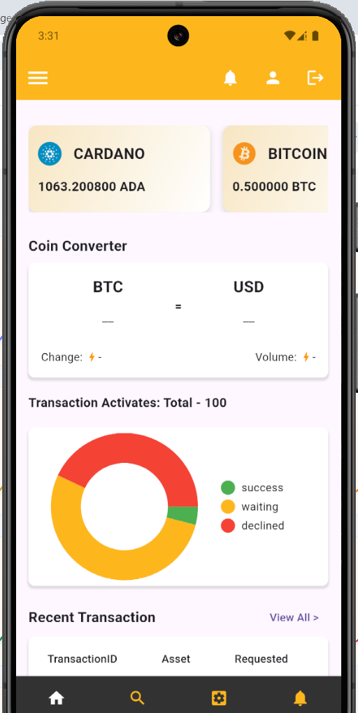
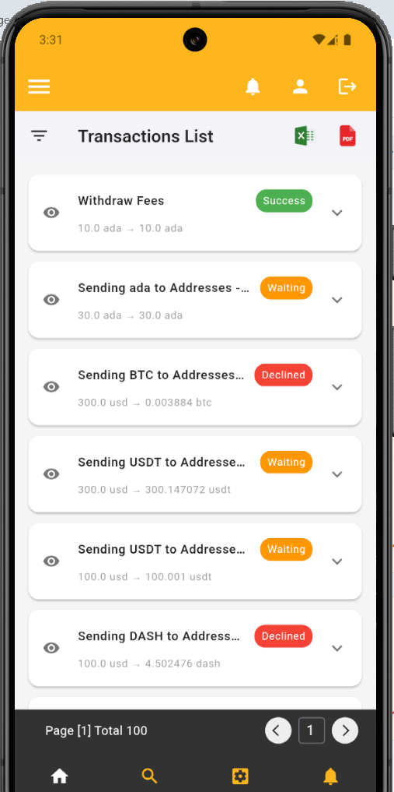

# 🚀 CryptoPay – Seamless Crypto Payments Platform

**CryptoPay** is a cross-platform mobile app built using **Flutter** for the frontend, **Node.js** for backend APIs, and **MongoDB** for database management. The app allows users to send and receive crypto payments with an intuitive UI and secure transactions.

---

## ✨ Features

- 🔐 Secure user authentication
- 💸 Send and receive crypto easily
- 📄 View transaction history
- 📱 Clean and modern Flutter UI
- 🌐 Node.js + MongoDB REST API backend

---

## 🛠️ Tech Stack

### 📱 Frontend
- Flutter (Dart)
- Provider / GetX (State Management)
- HTTP / Dio (API calls)

### 🧠 Backend
- Node.js + Express.js
- MongoDB + Mongoose
- JWT Authentication

---

## 📸 Screenshots

<div align="center">
  
  
  
  
</div>

---

## 🚀 Getting Started

### 1️⃣ Frontend Setup (Flutter)

```bash
git clone https://github.com/VIKAS-WEB/CryptoPay.git
cd CryptoPay
flutter pub get
flutter run
